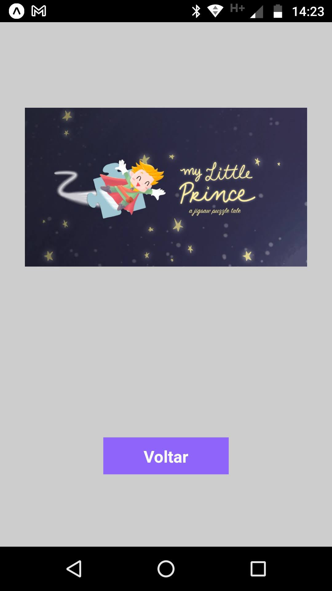

<h2>DEVinKwnoledge React Native Version</h2>

 

<ul>
<li>React Native</li>
</ul>

 

 Project developed during Senai's DEVinHouse course on 2022 (EDP edition). The project consists of an APP with a dynamic list of tips. The tips are saved in a fake API.

 

    

 

 The APP includes a three-screen stack navigator.

The initial screen includes a field to search for a tip, a panel with the tip amount of each category and the tip cards list. 

The tips category panel and the tip list are loaded from a fake API query.

At the top of the screen there is a search field where you can filter the list by post category.

The button at the bottom of the screen takes to the entering a tip screen. On this page, you can fill in a form with the tip and save it in the fake API. In the form, you must fill in the fields of title, language, category and tip description. In the category field there is a selector including Frontend, Backend, Fullstack and Softskills options.

 There is also the option to include a video. 

 

    

 

 Only tips with video will have a video icon to navigate to video screen. 

 

    

 

Back to the initial screen, pressing the tip card you open the tip form with options of edit or delete the tip.

 

    

 

<video controls width=400px>
        <source src="assets/devinknowledge.mp4" type="video/mp4"/>
    </video>
    
